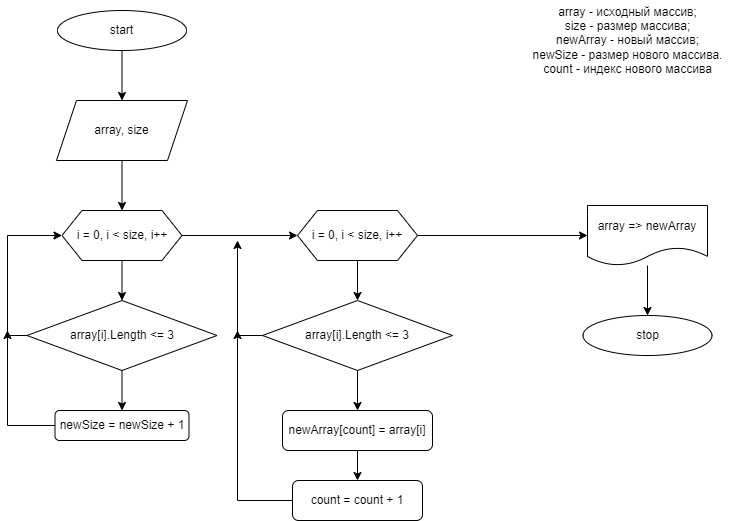

#Итоговая проверочная работа.

**Задача**: Написать программу, которая из имеющегося массива строк формирует массив из строк, длина которых меньше либо равна 3 символа. Первоначальный массив можно ввести с клавиатуры, либо задать на старте выполнения алгоритма. При решении не рекомендуется пользоваться коллекциями, лучше обойтись исключительно массивами.

##Блок-схема:

##Описание решения:
**Шаг первый**
Создаю новую консоль.

**Шаг второй**
Пишу блок ввода данных, в котором объявляю массив строк.

**Шаг третий**
Создаю метод для заполнения массива. 
*Для этого использовал цикл. Заполнение происходит нажатием клавиши **Enter**, после ввода элемента.*

**Шаг четвёртый**
Создаю метод поиска размера нового массива.
*Для этого, с помощью цикла ищу элементы массива, длина которого меньше или равна 3 и увеличиваю счётчик на 1*

**Шаг пятый**
Создаю метод заполнения нового массива.
*Для этого я в методе объявляю переменную **index** равную 0. 
Дальше использую тот же цикл, как и для поиска элемента массива с нужной длиной, но в этом методе я присваиавю значение найденого элемента и элементу нового массива с индексом **index**. Увеличиваю **index** на 1.*

**Шаг шестой**
Создаю метод вывода массива в консоль.
*Использую цикл и добавляю условие, при котором после эллемента ставится запятая*

**Шаг седьмой**
Заполняю исходный массив с помощью метода.

**Шаг восьмой**
Объявлю новую переменную размера нового массива и присваиваю ему результат выполнения метода из *Шага четыре*.

**Шаг девятый**
Объявляю новый массив с размером, полученным в методе.

**Шаг десятый**
Присваваю значения нового массива результат метода из *Шага пять*.

**Шаг одиннадцать**
Вывожу в консоль результат метода из *Шага три* методом из *Шага шесть*.

**Шаг двенадцать**
Вывожу в консоль символ " -> ", чтобы результат выводился как в задании.

**Шаг тринадцать**
Вывожу в консоль результат метода из *Шага пять* методом из *Шага шесть*.

**Шаг четырнадцать**
Проверяю работоспособность программы. Ура, работает!

**Шаг пятнадцать**
Добавляю переменную *run* и цикл, в котором зацикливаю всю программу. После выполнения программы пользователю предложат попробовать ещё раз. При нажатии клавиши *y* программа перезапустится, при нажатии любой другой - завершится.

**P.S.**
У меня была идея сделать условие, при котором, при отсутствии элементов, отвечающим требованиям задания, пользователь получал сообщение о том, что создать новый массив невозможно. Так же расширить возможности приложения, где пользователь мог сам выбирать длину элемента массива. Реализовывать это я не стал, так как в задании требуется следующий вывод : ["Russia", "Denmark", "Kazan"] -> [] или ["hello", "2", "world", ":-)"] -> ["2", ":-)"].

**P.P.S.**
Спасибо, что смотрели мою работу!

